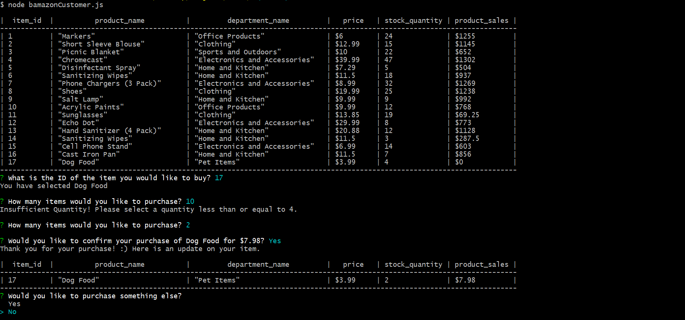
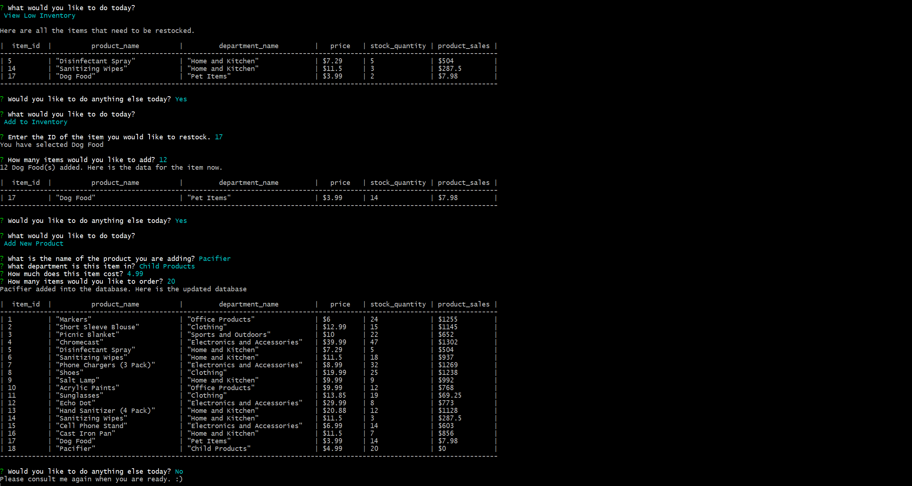

# Storefront-MySQL

A Node application that utilizes a MySQL database in order to provide a simple replication for a sample online retailer.

### GETTING STARTED

#### BUILT-WITH

```
Node.js : a JavaScript run-time environment that executes its code outside of the browser. 
    center-align : a Node.js package that allows for easier console text alignment and management.
    inquirer : a Node.js package that allows for user input.
    mysql : a Node.js package that allows for MySQL connections and queries to be run.
SQL Database : a language used to store and manipulate data within a Relational Database Management System (RDBMS).
```

#### INSTALLATION GUIDE

Storefront-MySQL requires an SQL server to run off of as well as a database populated with values.
The following packages also need to be installed using the following commands :

```
    npm install center-align
    npm install inquirer
    npm install mysql
```

The following sample queries can be added into the database.

##### Products Table

```sql
CREATE TABLE products(
  item_id INTEGER(10) NOT NULL AUTO_INCREMENT,
  product_name VARCHAR(45),
  department_name VARCHAR(45),
  price FLOAT(10),
  stock_quantity INTEGER(10),
  product_sales FLOAT(10),
  PRIMARY KEY (item_id)
);

INSERT INTO products (product_name, department_name, price, stock_quantity, product_sales)
VALUES ("Markers", "Office Products", 6.00, 24, 0);

INSERT INTO products (product_name, department_name, price, stock_quantity, product_sales)
VALUES ("Short Sleeve Blouse", "Clothing", 12.99, 15, 0);

INSERT INTO products (product_name, department_name, price, stock_quantity, product_sales)
VALUES ("Picnic Blanket", "Sports and Outdoors", 10.00, 22, 0);

INSERT INTO products (product_name, department_name, price, stock_quantity, product_sales)
VALUES ("Chromecast", "Electronics and Accessories", 39.99, 47, 0);

INSERT INTO products (product_name, department_name, price, stock_quantity, product_sales)
VALUES ("Disinfectant Spray", "Home and Kitchen", 7.29, 5, 0);

INSERT INTO products (product_name, department_name, price, stock_quantity, product_sales)
VALUES ("Sanitizing Wipes", "Home and Kitchen", 11.50, 18, 0);

INSERT INTO products (product_name, department_name, price, stock_quantity, product_sales)
VALUES ("Phone Chargers (3 Pack)", "Electronics and Accessories", 8.99, 32, 0);

INSERT INTO products (product_name, department_name, price, stock_quantity, product_sales)
VALUES ("Shoes", "Clothing", 19.99, 25, 0);

INSERT INTO products (product_name, department_name, price, stock_quantity, product_sales)
VALUES ("Salt Lamp", "Home and Kitchen", 9.99, 9, 0);

INSERT INTO products (product_name, department_name, price, stock_quantity, product_sales)
VALUES ("Acrylic Paints", "Office Products", 9.99, 12, 0);

INSERT INTO products (product_name, department_name, price, stock_quantity, product_sales)
VALUES ("Sunglasses", "Clothing", 13.85, 25, 0);

INSERT INTO products (product_name, department_name, price, stock_quantity, product_sales)
VALUES ("Echo Dot", "Electronics and Accessories", 29.99, 8, 0);

INSERT INTO products (product_name, department_name, price, stock_quantity, product_sales)
VALUES ("Hand Sanitizer (4 Pack)", "Home and Kitchen", 20.88, 12, 0);

INSERT INTO products (product_name, department_name, price, stock_quantity, product_sales)
VALUES ("Sanitizing Wipes", "Home and Kitchen", 11.50, 27, 0);

INSERT INTO products (product_name, department_name, price, stock_quantity, product_sales)
VALUES ("Cell Phone Stand", "Electronics and Accessories", 6.99, 14, 0);

INSERT INTO products (product_name, department_name, price, stock_quantity, product_sales)
VALUES ("Cast Iron Pan", "Home and Kitchen", 11.50, 7, 0);
```

##### Departments Table

```sql
CREATE TABLE departments(
  department_id INTEGER(10) NOT NULL AUTO_INCREMENT,
  department_name VARCHAR(45),
  over_head_costs FLOAT(10),
  PRIMARY KEY (department_id)
);

INSERT INTO departments (department_name, over_head_costs)
VALUES ("Beauty and Health", 799);

INSERT INTO departments (department_name, over_head_costs)
VALUES ("Books", 127);

INSERT INTO departments (department_name, over_head_costs)
VALUES ("Child Products", 439);

INSERT INTO departments (department_name, over_head_costs)
VALUES ("Clothing", 876);

INSERT INTO departments (department_name, over_head_costs)
VALUES ("Electronics and Accessories", 925);

INSERT INTO departments (department_name, over_head_costs)
VALUES ("Food and Grocery", 715);

INSERT INTO departments (department_name, over_head_costs)
VALUES ("Home and Kitchen", 983);

INSERT INTO departments (department_name, over_head_costs)
VALUES ("Office Products", 831);

INSERT INTO departments (department_name, over_head_costs)
VALUES ("Pet Items", 115);

INSERT INTO departments (department_name, over_head_costs)
VALUES ("Sports and Outdoors", 328);
```

### DEMO


### WEBSITE AND IMAGES

#### bamazonCustomer.js

Customers have the opportunity to view the store's directory as well as purchase items. These purchases will be logged into respective item sales for managers and supervisors to view.



#### bamazonManager.js

Managers are given the choices to view the list of products, view items that are low on inventory, restock items, and add new items.



#### bamazonSupervisor.js

Supervisors hold a lesser, but overall role of adding new departments into the system as well as viewing the sales provided by each individual department.


### TO-DO / BUGS
- Node programs must be exited manually.